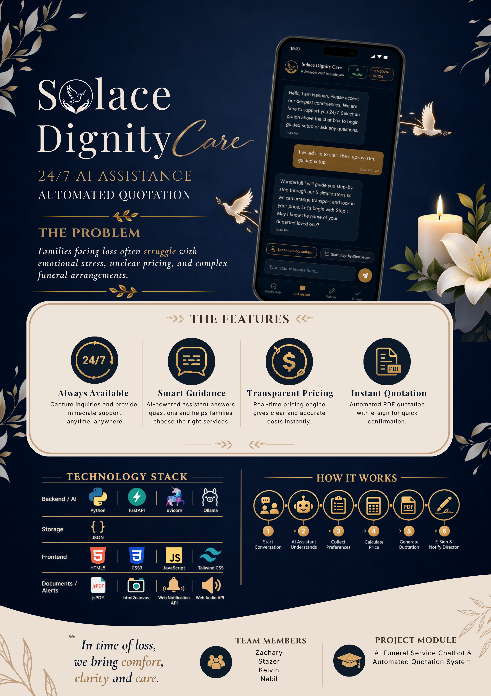

# Solace Dignity Care — 24/7 Conversational AI Sales Assistant & Automated Quotation Engine

**Project CP-004 · KLASS Engineering problem statement**
Higher Nitec in AI Applications · ITE College Central 
 
A locally-hosted funeral-services assistant that helps bereaved families arrange a service at
any hour, produces an exact quotation, and hands over to a human consultant when needed.

Everything runs on your own machine. No family data is sent to any external service.



---

## Why this project is interesting

**Prices can never be hallucinated.** Every figure comes from deterministic Python arithmetic
reading `data/dataset.json`. The language model is never asked to produce a number. A wrong
price shown to a grieving family is a real harm, so the boundary is enforced in code rather
than by prompting.

**It still works when the AI is offline.** If Ollama is unavailable, the assistant falls back
to a curated vector index of **134 verified answers** with a similarity threshold and a margin
gate — it answers only when confident, rather than guessing.

**Nothing leaves the machine.** The language model, speech recognition and speech synthesis
all run locally. No API keys, no subscriptions, no third-party inference.

---


## Features

### Core — from the KLASS problem statement

| Feature | What it does |
| ------- | ------------ |
| **24/7 empathetic conversational intake** | Guided 17-step arrangement flow with a bereavement-appropriate tone, capturing late-night leads that would otherwise be lost |
| **Dynamic package & add-on Q&A** | Answers grounded in the company's own service catalogue, spanning religious rites, casket options and logistics |
| **Real-time dynamic pricing engine** | Deterministic Python arithmetic recalculates an itemised quote as tiers, wake durations, venues and add-ons change — the language model never produces a number |
| **Automated quotation & e-sign pipeline** | Compiles the final configuration into an institutional itemised PDF and captures a binding digital signature in the same session |

### Additional — beyond the brief

| Feature | What it does |
| ------- | ------------ |
| **Human consultant handoff** | The family can escalate to a director, who takes over the same conversation live from the staff portal |
| **Secure document upload** | Death certificates validated by magic bytes rather than file extension, size-capped during streaming, stored outside the web root and reachable only with a valid admin token |
| **Four-language interface** | English, 中文, Bahasa Melayu and தமிழ், including Singapore-specific funeral vocabulary and correct handling of SGD prices |
| **Local speech-to-text** | `faster-whisper` (`base.en`) transcribes on-device, so audio never leaves the machine |
| **Local text-to-speech** | Kokoro-82M generates English replies locally; other languages use the browser voice |
| **Offline answer engine** | 134 curated entries behind a confidence threshold and a margin gate — the assistant keeps working with Ollama down, rather than showing an error |
| **Safety routing** | Crisis detection and prompt-injection guards classify every message *before* it reaches the language model |
| **Accounts with saved arrangements** | Log out part-way through and resume later, because families rarely complete this in one sitting |

---

## Table of contents

1. [What you need before starting](#1-what-you-need-before-starting)
2. [Setup — step by step](#2-setup--step-by-step)
3. [Running the application](#3-running-the-application)
4. [Trying it out](#4-trying-it-out)
5. [Testing](#5-testing)
6. [How it works](#6-how-it-works)
7. [Project structure](#7-project-structure)
8. [Configuration reference](#8-configuration-reference)
9. [Troubleshooting](#9-troubleshooting)
10. [Privacy and security](#10-privacy-and-security)

---

## 1. What you need before starting

| Requirement | Minimum | Notes |
|---|---|---|
| **Operating system** | Windows 10 or 11 | Instructions below are for Windows |
| **Python** | 3.10 or newer | Tick **"Add Python to PATH"** during install |
| **Ollama** | Latest | Runs the local language model |
| **RAM** | 8 GB (16 GB recommended) | The model runs on CPU |
| **Free disk space** | ~10 GB | Model weights are large |
| **Internet** | First-time setup only | Needed to download packages and models. The app runs offline afterwards |

**Downloads:**
- Python — https://www.python.org/downloads/
- Ollama — https://ollama.com/download
- Git — https://git-scm.com/download/win

Check Python is installed by opening **Command Prompt** and running:

```
python --version
```

You should see `Python 3.10.x` or higher.

---

## 2. Setup — step by step

### Step 1 — Clone the repository

```
git clone https://github.com/stazerwee-ui/CP-004-AIPD-24-7-Conversational-AI-Sales-Assistant-Automated-Quotation-Engine.git
cd CP-004-AIPD-24-7-Conversational-AI-Sales-Assistant-Automated-Quotation-Engine
```

### Step 2 — Create a virtual environment

Keeps this project's packages separate from anything else on your machine.

```
python -m venv venv
venv\Scripts\activate
```

Your prompt should now start with `(venv)`.

### Step 3 — Install Python packages

```
pip install --upgrade pip
pip install -r requirements.txt
```

This takes a few minutes. It installs FastAPI, `faster-whisper` for speech recognition,
`kokoro-onnx` for speech synthesis, and `fastembed` for the offline answer index.

### Step 4 — Create your `.env` file

The project reads its configuration from a `.env` file, which is **not** committed to the
repository because it holds a credential.

```
copy .env.example .env
```

Open `.env` in Notepad. The template ships with a placeholder:

```
SOLACE_ADMIN_TOKEN=change_me_before_running
```

Replace it with a strong token of your own. Generate one with:

```
python -c "import secrets; print(secrets.token_urlsafe(32))"
```

Paste the result after `SOLACE_ADMIN_TOKEN=`, so the line looks like:

```
SOLACE_ADMIN_TOKEN=<your-generated-token-here>
```

> **Remember this value.** You will type it into the Director & Staff Portal login prompt.
> If the variable is missing entirely, the admin routes return `503`. If the token you type
> does not match, they return `401`.

### Step 5 — Install Ollama and pull the model

Install Ollama from the link above. It starts automatically as a background service on
Windows — you do **not** need to run `ollama serve`.

```
ollama pull qwen3.5:4b
ollama list
```

You should see `qwen3.5:4b` listed.

> **Weaker machine?** The backend probes Ollama for an available model and falls back
> automatically through `qwen2.5:3b`, `qwen2.5:1.5b`, `llama3.2:3b`, `llama3.2:1b` and
> `phi3:mini`. Any one of these will work; `qwen3.5:4b` gives the best answers.

### Step 6 — Download the speech models and support tools

These files are too large for GitHub, so they are downloaded here instead.

```
install_dependencies.bat
```

This fetches:
- `models/kokoro-v1.0.onnx` — neural text-to-speech weights (~311 MB)
- `models/voices-v1.0.bin` — voice pack (~27 MB)
- `tools/cloudflared.exe` — tunnel for the mobile demo

**Verify the download completed:**

```
dir models
```

Both files must be present and full size. If they are missing, voice output will silently
fall back to your browser's built-in speech instead of Kokoro.

### Step 7 — Build and verify the offline answer bundle

```
python scripts\prepare_offline_bundle.py --download
python scripts\prepare_offline_bundle.py --verify
```

The verify step confirms the 134-entry offline answer engine works with no network access.

---

## 3. Running the application

With the virtual environment active:

```
venv\Scripts\activate
uvicorn main:app --host 127.0.0.1 --port 8000
```

Then open your browser at **http://127.0.0.1:8000**

**To stop the server:** press `Ctrl + C` in the Command Prompt.

> `python main.py` also works. It binds to `127.0.0.1` by default, so the server is
> reachable only from this machine. To allow a phone on the same network, set
> `APP_HOST=0.0.0.0` in your `.env`.

### Running it on your phone (optional)

**Option A — same Wi-Fi (quick, no voice).**

```
uvicorn main:app --host 0.0.0.0 --port 8000
```

Find your computer's local IP with `ipconfig`, then open `http://YOUR-IP:8000` on a phone
on the same Wi-Fi.

The **microphone will not work** this way. Browsers only grant microphone access over
`https://` or `localhost`, so voice input is unavailable over a LAN IP. Use Option B for
the voice features.

**Option B — HTTPS tunnel (needed for voice).**

```
start_live_demo.bat
```

This starts the backend if it is not already running, opens a Cloudflare tunnel, and prints
an `https://...` address. Open that on the phone — because it is HTTPS, the microphone and
speech-to-text work normally.

> While the tunnel is open, the address is reachable by anyone who has it, and the admin
> token is the only thing protecting the staff console. Close the window when finished.
> The tunnel exposes the local server; it does not send data anywhere else — the models,
> the database and all family data stay on the host machine.

---

## 4. Trying it out

### As a family member

1. Enter a name and a phone number or email on the entry screen
2. Choose a starting point from the four tiles on the Family Hub
3. Ask the assistant anything, or start the guided setup
4. Build an arrangement in the Planner and watch the price update
5. Sign the quotation on the E-Sign screen and download the PDF

**Things worth trying:**
- Ask *"how much is a Buddhist 3-day funeral?"* — the price comes from deterministic Python, never the language model
- Tap the microphone and speak — transcription runs locally via `faster-whisper` (`base.en`)
- Tap the speaker icon on an English reply — the voice is generated locally by Kokoro-82M
- Switch language — English, 中文, Bahasa Melayu, தமிழ்
- Say *"I want to speak to a human"* — this escalates to a consultant

### As a director

1. On the entry screen, click **🔐 Director & Staff Portal** (bottom of the guest access panel)
2. Enter the `SOLACE_ADMIN_TOKEN` value from your `.env`
3. Review escalated tickets, take over a conversation, reply to the family live, and inspect
   uploaded documents

---

## 5. Testing

```
python scripts\test_bereavement_documents.py
python scripts\test_optimizations.py
python scripts\test_challenging.py
```

- `test_bereavement_documents.py` — secure document isolation and token-gated access
- `test_optimizations.py` — intent routing and response caching
- `test_challenging.py` — intake edge cases and objection handling

---

## 6. How it works

```text
┌─────────────────────────────────────────────────────────────────┐
│                        Web frontend                             │
│        HTML5 · vanilla JS · CSS · 4-language i18n runtime       │
└────────────────────────────────┬────────────────────────────────┘
                                 │ REST
┌────────────────────────────────▼────────────────────────────────┐
│                     FastAPI backend (main.py)                   │
├─────────────────────────────────────────────────────────────────┤
│   Semantic router & intent classifier                           │
│        ├── Mode A: Ollama local LLM (qwen3.5:4b, with fallback) │
│        └── Mode B: offline answer index (134 curated entries)   │
│                                                                 │
│   Deterministic pricing · safety guard · admin auth             │
├─────────────────────────────────────────────────────────────────┤
│   SQLite · Kokoro-82M TTS · faster-whisper STT                  │
└─────────────────────────────────────────────────────────────────┘
```

**Pricing.** Calculated in `/api/calculate` from values in `data/dataset.json` and rules in
`data/funeral_package_rules.json`. The model never produces a number.

**Offline mode.** `offline_answers.py` builds an index from `dataset.json`: 85 FAQ entries
that pass a length and quality filter, plus 49 blog articles with any priced content
excluded — 134 total. Queries are matched by cosine similarity with a confidence threshold.

**Voice.** Speech-to-text is `faster-whisper` (`base.en`) via `/api/transcribe`. Speech
synthesis is Kokoro-82M via `/api/speak`, with generated audio cached and the opening
greeting pre-rendered at startup so the first reply plays instantly.

> **Voice output is Kokoro for English only.** Chinese, Malay and Tamil replies use the
> browser's built-in speech synthesis, because the bundled Kokoro voice pack is English.
> If the Kokoro weights are missing from `models/`, English also falls back to the browser
> voice — see Troubleshooting.

---

## 7. Project structure

```text
├── main.py                      FastAPI backend — all API endpoints
├── app.js                       Frontend logic (vanilla JavaScript)
├── index.html                   Single-page interface
├── style.css                    Styling
├── semantic_router.py           Intent classification and embedding provider
├── offline_answers.py           Vector search fallback when Ollama is unavailable
├── i18n_auto.js                 Runtime translation of dynamically rendered content
├── i18n_extract.py              Extracts static HTML strings to i18n_worksheet.csv
├── i18n_merge.py                Merges translated worksheets back into app.js
├── requirements.txt             Python dependencies
├── .env.example                 Configuration template (copy to .env)
├── .gitignore                   Excludes secrets, family data and model weights
├── install_dependencies.bat     Downloads speech weights and cloudflared
├── start_live_demo.bat          One-click HTTPS mobile demo
│
├── data/                        22 datasets — catalogue, pricing, FAQs, procedures
│   ├── dataset.json             Catalogue, packages, pricing, FAQs and articles
│   ├── funeral_package_rules.json   Pricing and upgrade rules
│   └── ...                      Religious, legal, emergency and policy datasets
│
├── scripts/                     Offline bundle preparation and test suite
├── assets/images/               Product and package imagery
├── models/                      Speech weights (downloaded, not committed)
├── tools/                       cloudflared.exe (downloaded, not committed)
└── docs/                        Project documentation and showcase
```

---

## 8. Configuration reference

Copy `.env.example` to `.env` and edit.

**Read by the application:**

| Variable | Default | Purpose |
|---|---|---|
| `SOLACE_ADMIN_TOKEN` | *(required)* | Token for the Director & Staff Portal and secure document endpoints. No default — the admin routes return `503` without it |
| `SOLACE_EMBED_PROVIDER` | `auto` | Embedding backend for the offline index: `fastembed`, or leave unset to auto-detect |
| `SOLACE_MODEL_PATH` | `./models` | Directory holding the local model weights |
| `OLLAMA_HOST` | `http://127.0.0.1:11434` | Where the Ollama service is listening |
| `OLLAMA_MODEL` | `qwen3.5:4b` | Preferred model. Falls back automatically through the chain in Step 5 if this one is not installed |
| `APP_HOST` | `127.0.0.1` | Server binding when run via `python main.py`. Set to `0.0.0.0` to allow access from a phone on the same network |
| `APP_PORT` | `8000` | Server port |

Every variable above has a working default except `SOLACE_ADMIN_TOKEN`, so a `.env` copied
from `.env.example` needs only that one value filled in.

**`.env` is excluded by `.gitignore`, and no credential appears anywhere in the source.**
The admin check reads the token from the environment and uses `secrets.compare_digest` for
constant-time comparison.

---

## 9. Troubleshooting

**`'python' is not recognised`**
Python is not on your PATH. Reinstall and tick *"Add Python to PATH"*.

**`'uvicorn' is not recognised`**
The virtual environment is not active. Run `venv\Scripts\activate` first.

**Director Portal returns `503`**
`SOLACE_ADMIN_TOKEN` is missing from `.env`. Complete Step 4.

**Director Portal returns `401`**
The token you typed does not match the one in `.env`. They must be identical.

**Voice output sounds like a generic Windows voice, not Kokoro**
Two possible causes.

1. You are using a non-English language. Chinese, Malay and Tamil use the browser voice by
   design — only English uses Kokoro.
2. The Kokoro weights are missing. Run `dir models` and confirm `kokoro-v1.0.onnx` (~311 MB)
   and `voices-v1.0.bin` are both present and full size. If not, re-run
   `install_dependencies.bat`. Also confirm the package is installed with
   `pip show kokoro-onnx`.

The fallback is silent by design, so check the server console for `[Kokoro TTS]` messages
when you tap the speaker icon.

**Microphone does not work**
Browsers only allow microphone access over `https://` or `localhost`. Use
`http://127.0.0.1:8000` on a computer, or `start_live_demo.bat` for a phone. A LAN IP will
not work.

**Chat replies are slow, or the app reports the AI is offline**
Check Ollama with `ollama list`. If no model is listed, run `ollama pull qwen3.5:4b`.
Replies take a few seconds on CPU — this is normal. With no model at all, the app still
answers from the 134-entry offline index.

**`Error: listen tcp 127.0.0.1:11434: bind: Only one usage of each socket address`**
Ollama is already running as a Windows service. Harmless — do not run `ollama serve`.

**Port 8000 already in use**
Run on a different port: `uvicorn main:app --port 8001`

---

## 10. Privacy and security

This project handles bereavement information, so several things are deliberate:

- **Nothing leaves the machine.** Language model, speech recognition and speech synthesis
  all run locally. No external AI APIs.
- **The admin token is never committed.** It is read from `.env` at runtime and compared
  with `secrets.compare_digest`. The admin routes refuse to serve rather than fall back to
  a known default.
- **Passwords** are hashed with PBKDF2-HMAC-SHA256 and a per-user salt.
- **NRIC and FIN numbers** are masked before any text reaches the model or the logs.
- **Uploaded documents** (such as death certificates) are stored in `solace_secure_docs/`,
  outside the public web directory, and are reachable only with a valid admin token.
- **The database, uploaded documents and consultant tickets are excluded from this
  repository** — they contain records from testing and must not be published.

---

## Credits

- **Ollama** — local LLM runtime · https://ollama.com/
- **Kokoro-82M / kokoro-onnx** — neural text-to-speech · https://github.com/thewh1teagle/kokoro-onnx
- **faster-whisper** — speech recognition · https://github.com/SYSTRAN/faster-whisper
- **FastEmbed** — embeddings · https://github.com/qdrant/fastembed
- **FastAPI** — backend framework · https://fastapi.tiangolo.com/
- **Cloudflare Tunnel** — HTTPS mobile demo

Developed for ITE College Central · Higher Nitec in AI Applications
Project CP-004 · KLASS Engineering

<!-- TODO: the repository has no LICENSE file. Either add one (MIT is the usual choice for
     a student project) and restore a licence line here, or leave this out. Do not claim a
     licence that isn't in the repo. -->
